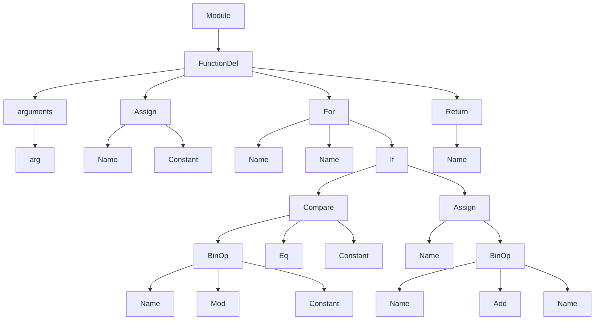

```mermaid
flowchart TD
    n0["Module"]
    n1["FunctionDef"]
    n2["arguments"]
    n3["arg"]
    n2 --> n3
    n1 --> n2
    n4["Assign"]
    n5["Name"]
    n4 --> n5
    n6["Constant"]
    n4 --> n6
    n1 --> n4
    n7["For"]
    n8["Name"]
    n7 --> n8
    n9["Name"]
    n7 --> n9
    n10["If"]
    n11["Compare"]
    n12["BinOp"]
    n13["Name"]
    n12 --> n13
    n14["Mod"]
    n12 --> n14
    n15["Constant"]
    n12 --> n15
    n11 --> n12
    n16["Eq"]
    n11 --> n16
    n17["Constant"]
    n11 --> n17
    n10 --> n11
    n18["Assign"]
    n19["Name"]
    n18 --> n19
    n20["BinOp"]
    n21["Name"]
    n20 --> n21
    n22["Add"]
    n20 --> n22
    n23["Name"]
    n20 --> n23
    n18 --> n20
    n10 --> n18
    n7 --> n10
    n1 --> n7
    n24["Return"]
    n25["Name"]
    n24 --> n25
    n1 --> n24
    n0 --> n1
```
