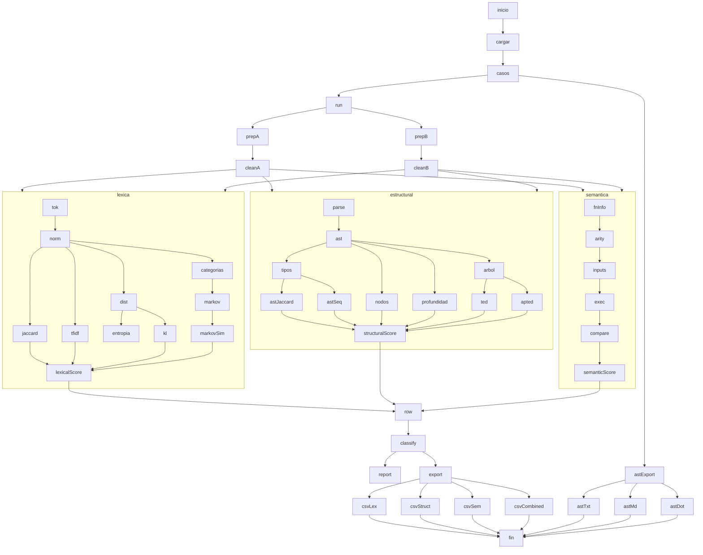

```mermaid
flowchart TD
    inicio --> cargar
    cargar --> casos
    casos --> run

    run --> prepA
    run --> prepB

    prepA --> cleanA
    prepB --> cleanB

    cleanA --> lexica
    cleanB --> lexica
    cleanA --> estructural
    cleanB --> estructural
    cleanA --> semantica
    cleanB --> semantica

    subgraph lexica
        tok --> norm
        norm --> jaccard
        norm --> tfidf
        norm --> dist
        dist --> entropia
        dist --> kl
        norm --> categorias
        categorias --> markov
        markov --> markovSim

        jaccard --> lexicalScore
        tfidf --> lexicalScore
        kl --> lexicalScore
        markovSim --> lexicalScore
    end

    subgraph estructural
        parse --> ast
        ast --> tipos
        ast --> arbol
        tipos --> astJaccard
        tipos --> astSeq
        ast --> nodos
        ast --> profundidad
        arbol --> ted
        arbol --> apted

        astJaccard --> structuralScore
        astSeq --> structuralScore
        nodos --> structuralScore
        profundidad --> structuralScore
        ted --> structuralScore
        apted --> structuralScore
    end

    subgraph semantica
        fnInfo --> arity
        arity --> inputs
        inputs --> exec
        exec --> compare
        compare --> semanticScore
    end

    lexicalScore --> row
    structuralScore --> row
    semanticScore --> row

    row --> classify
    classify --> report
    classify --> export

    export --> csvLex
    export --> csvStruct
    export --> csvSem
    export --> csvCombined

    casos --> astExport
    astExport --> astTxt
    astExport --> astMd
    astExport --> astDot

    csvLex --> fin
    csvStruct --> fin
    csvSem --> fin
    csvCombined --> fin
    astTxt --> fin
    astMd --> fin
    astDot --> fin
```